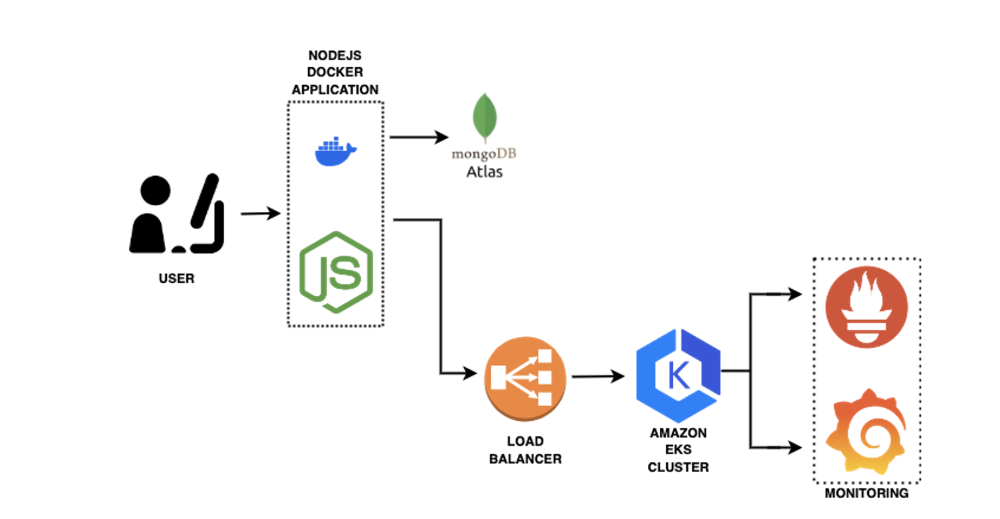
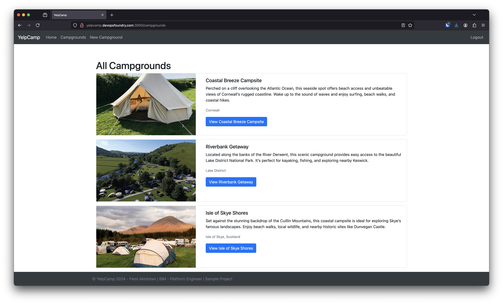
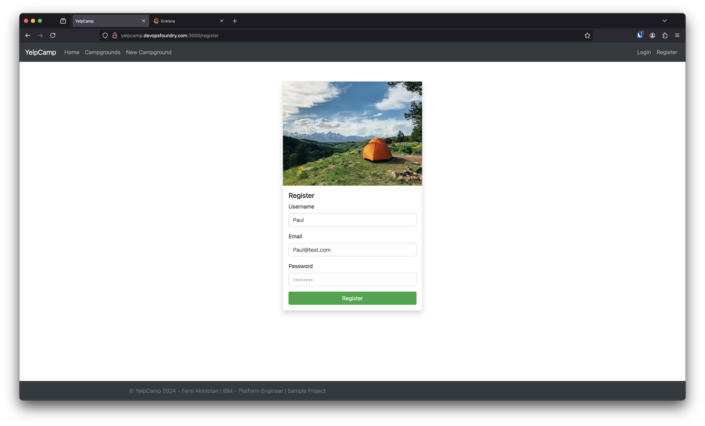
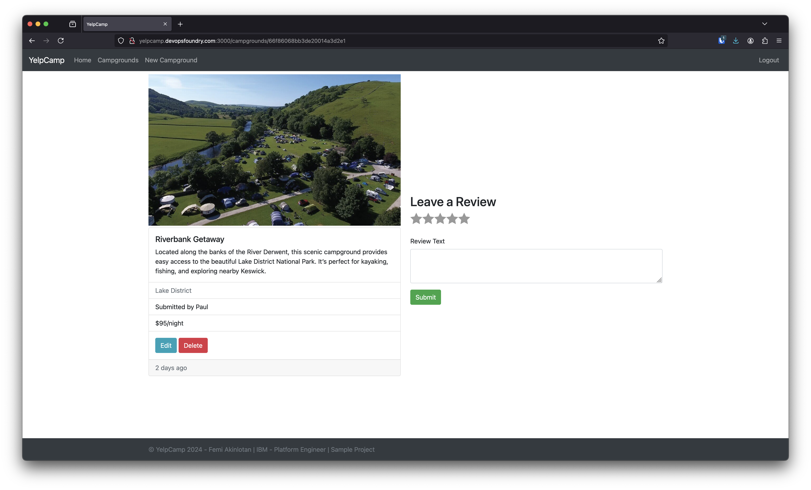
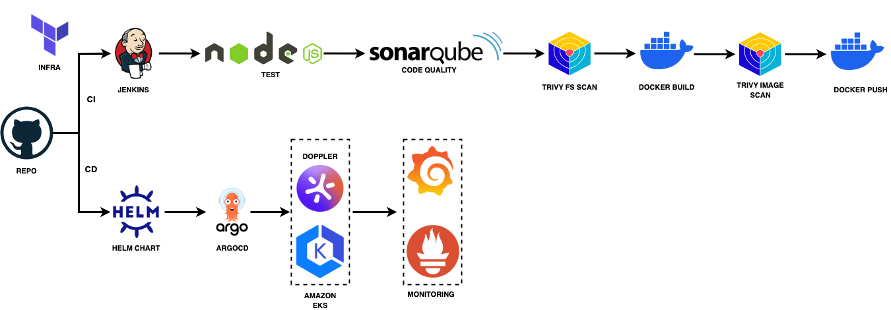
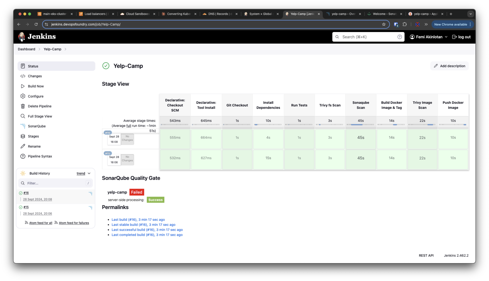
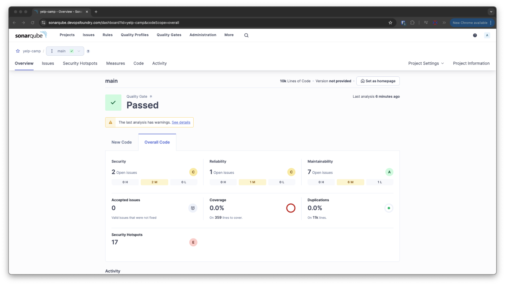
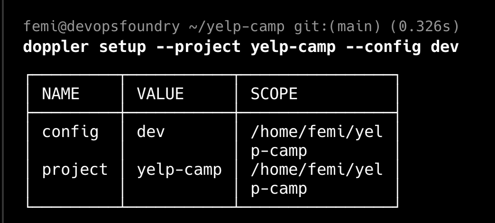
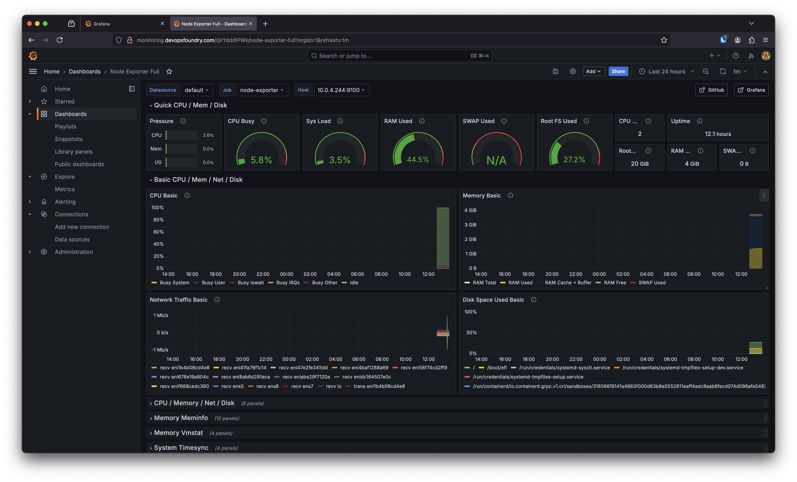

# Yelp Camp Web Application

This web application allows users to add, view, access, and rate campgrounds by location. It is based on "The Web Developer Bootcamp" by Colt Steele, but includes several modifications and bug fixes. The application leverages a variety of technologies and packages, such as:

- **Node.js with Express**: Used for the web server.
- **Bootstrap**: For front-end design.
- **Mapbox**: Provides a fancy cluster map.
- **MongoDB Atlas**: Serves as the database.
- **Passport package with local strategy**: For authentication and authorization.
- **Cloudinary**: Used for cloud-based image storage.
- **Helmet**: Enhances application security.

## Local Setup

To get this application up and running, you'll need to set up accounts with Cloudinary, Mapbox, and MongoDB Atlas. Once these are set up, create a `.env` file in the same folder as `app.js`. This file should contain the following configurations:

```sh
CLOUDINARY_CLOUD_NAME=[Your Cloudinary Cloud Name]
CLOUDINARY_KEY=[Your Cloudinary Key]
CLOUDINARY_SECRET=[Your Cloudinary Secret]
MAPBOX_TOKEN=[Your Mapbox Token]
DB_URL=[Your MongoDB Atlas Connection URL]
SECRET=[Your Chosen Secret Key] # This can be any value you prefer
```

After configuring the .env file, you can start the project by running:
```sh
docker compose up
```

## Kubernetes Setup



### Doppler Secrets Management Setup

Sign up for a free account at [Doppler](https://doppler.com/)

1. Create a new project called `yelp-camp`
2. Add your secrets to the project
  

#### Install Doppler Operator using Helm

First-time cluster setup (one-time only):

```sh
helm repo add doppler https://helm.doppler.com
helm install doppler-operator doppler/doppler-kubernetes-operator
```

####  For your application deployment:

  1. Create Doppler Service Token
```sh
doppler login
doppler setup
doppler configs tokens create --name "k8s-yelp-camp" --config prd
# This will output a token like dp.st.xxxx
```

  2. Create a new file called `doppler-values.yaml` in the `helm-chart/templates` directory and add the following content:
```sh
doppler:
  serviceToken: "dp.st.xxxx"

replicaCount: 1
service:
  type: ClusterIP 
```

  3. Deploy application
```sh
helm install yelp-camp . -f doppler-values.yaml
```

## Application Screenshots








